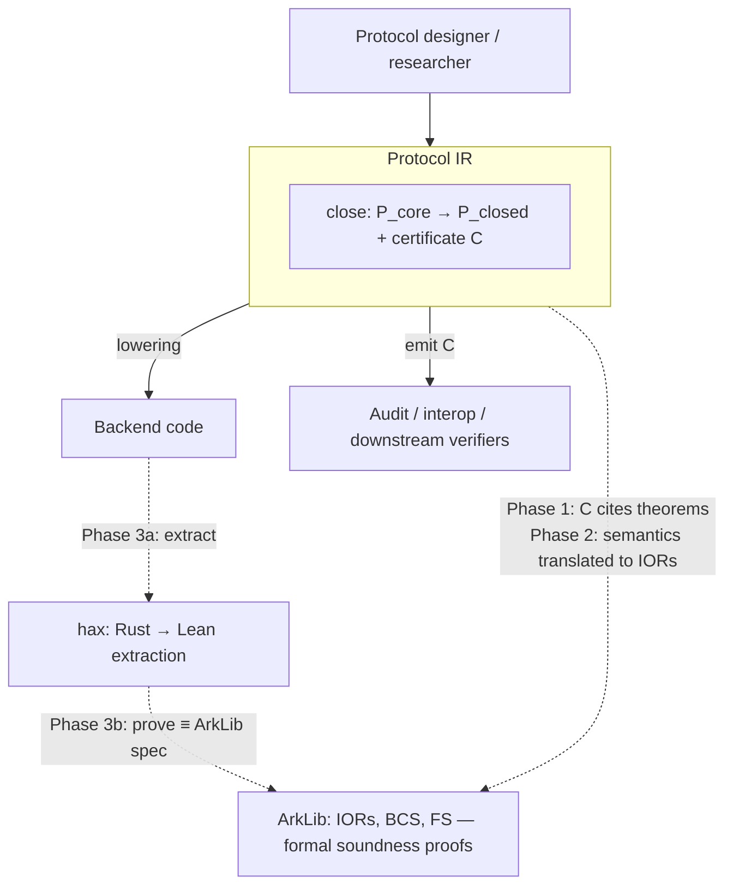

# Positioning

## §0. TL;DR

Protocol IR is a typed compilation IR for ZK protocol composition, carried by an [MLIR][mlir] dialect, sitting between formal specifications and backend prover code. [ArkLib][arklib] (Lean) proves protocol soundness as Lean theorems, but those theorems stay inside the proof assistant; Rust prover libraries today are built per-library against them by hand.

Protocol IR is the layer through which those theorems reach deployed code, via a traveling certificate that cites them as machine-checkable evidence. [hax][hax] sits as a vertical verification path between specific Rust libraries and Lean specs; Protocol IR generates those libraries coherently across protocol families and backends.

---

## §1. The gap — why an IR layer

ZK protocol decisions — hash choice, domain separation, absorb order, challenge derivation — currently live invisibly inside backend implementations. They are the protocol's semantic face, yet have no typed place to live. The cost of this invisibility shows up as ecosystem fragmentation.

Three concrete signals:

- **Halo2 fork divergence.** zcash, Privacy & Scaling Explorations, Scroll, and Axiom share the same broad [Halo2][halo2] lineage but close the protocol with different sponges, codecs, and transcript disciplines. Nothing in the existing toolchain treats the divergence as a typed object.
- **zkVM frontends.** Each zkVM ships its own proving stack with overlapping protocol building blocks — FRI/Merkle PCS, lookup arguments, sumcheck — but different prover libraries and verifier APIs. New backends arrive faster than per-library verification can keep up.
- **Backend-layer churn.** arkworks's archival of [`ark-sponge`][ark-sponge] and migration to [`spongefish`][spongefish] ([CFRG-FS][cfrg-fs] / [Chiesa-Orrù][chiesa-orru] aligned) shows that even the byte-level construction layer is volatile.

The cost model is N × M. Securing N protocols across M backends in the current stack — each (protocol, backend) pair an independent Rust library, each verified independently against a formal spec — yields N × M libraries with N × M verifications and no common contract format. The formal verification work — ArkLib in Lean, hax for Rust extraction — currently happens per library, isolated from any shared compilation contract. Audit and interop tools must analyze each library separately. With a typed IR layer, the cost reduces to N + M: N protocol descriptions, M backend lowering passes, and a uniform certificate that downstream consumers read as a contract.

---

## §2. The Protocol IR layer

Protocol IR sits above relation/circuit IR (e.g., [LLZK][llzk]) and below backend code, carried by an MLIR dialect. The core object is `P_core` — an open public-coin interactive source presented through typed components and composed by typed operators. The initial scope provides component families like `PCS`, `LDT`, `Lookup`, `Sumcheck`, `FS` and operators `link`, `par`, `fold`, `repeat_t`; both sets are open to extension.

A composed `P_core` lowers through MLIR passes to backend prover code (Rust libraries, zkVM frontends, hardware-targeted realizations), parameterized by the backend witness `B` (sponge, codec, field encoding, library binding). Lowering emits both the compiled artifact and a traveling certificate `C` whose rows reopen surgically when backend choices change — a sponge change reopens `c_fs` construction rows; a PCS swap from KZG to IPA reopens binding/extractability rows; the rest of the certificate stays valid.

Composition is type-checked at compose time: `close` admits a sealed artifact only when six structural obligations discharge (`TraceOK`, `BindOK`, `SepOK`, `ConstructOK`, `TheoremOK`, `BudgetOK`), catching [structural bugs that real ZK audits have surfaced][frozen-heart] — missing public-input absorbs, out-of-order challenge derivations, namespace collisions — at compile time. Technical details are in [`protocol-ir`](./@wonj/protocol-ir).

---

## §3. Relationship to ArkLib

ArkLib formalizes Interactive Oracle Reductions, the interactive BCS transformation, and duplex-sponge Fiat-Shamir, with completeness and round-by-round knowledge soundness proven as Lean theorems. The active formalizations target Sum-Check, Spartan, FRI, STIR/WHIR, and Binius. The conceptual core overlaps Protocol IR's `P_core` substantially — both take interactive oracle reductions as the central object, both provide sequential composition and lifting, both decompose PLONK along zero-check / permutation / quotienting lines, and both describe themselves as "modular and composable frameworks for SNARKs." This overlap is real and worth stating directly.

ArkLib's outputs are verified Lean terms — useful within the proof assistant, but not lowered, not compiled, and not directly consumed by audit pipelines, MLIR carriers, or Rust prover backends. Each (protocol, backend) pair currently requires per-library handcraft to bridge the gap between a verified Lean spec and a deployed Rust library. Even when ArkLib's IORs and FS proofs are complete, the path from those proofs to a running prover is artisanal.

Protocol IR is the layer that connects ArkLib to the deployment toolchain. Its lowered outputs — Rust libraries, zkVM frontends, hardware realizations — are precisely the deployed libraries that ArkLib's theorems are about. Its certificate `C` carries machine-checkable handles to those theorems so consumers can fetch and re-verify them independently, outside Lean.

The natural analogy is LLVM IR ↔ [Vellvm][vellvm]. LLVM IR is a typed compilation surface; Vellvm formalizes its semantics in Coq and proves theorems about it. Protocol IR plays the role of LLVM IR at the protocol-object layer; ArkLib plays the role of Vellvm — the formal-spec target the IR's certificate cites. The compilation IR is how the formal-spec target's guarantees reach deployment.

Protocol IR's compose-time discipline parallels LLVM IR's `opt -verify`: a compilation IR enforcing structural conditions that the formal-spec target assumes as preconditions. ArkLib's theorems hold *given* a well-formed `P_core`; Protocol IR's `close` checks well-formedness at compose time, catching those structural bugs at compile time.

**Protocol IR : ArkLib :: LLVM IR : Vellvm.**

---

## §4. Relationship to hax

hax (Cryspen) translates a subset of Rust into formal verification languages — F\*, Rocq, Lean, SSProve, ProVerif — via `cargo hax into <backend>`. Its direction is fixed: existing Rust code → formal spec for verification. The intended ArkLib + hax workflow is to extract a Rust prover library to Lean and prove equivalence with the ArkLib IOR specification.

hax + ArkLib alone does not address the N × M gap. hax verifies one Rust library against one Lean spec at a time. Each (protocol, backend) pair is an independent library, an independent extraction, and an independent equivalence proof, with no common contract format across libraries. Audit tools end up reading each Rust library as a separate artifact.

Protocol IR and hax run in opposite directions. Protocol IR is a generation path — a typed `P_core` lowers top-down through MLIR passes to multiple Rust backends, with a uniform certificate `C` across them. hax is a verification path — existing Rust extracted bottom-up into a Lean spec. The two compose: a Protocol-IR-lowered Rust library can be extracted by hax to Lean and proven equivalent to the same ArkLib spec the certificate already cites. The three layers — Protocol IR (compilation), ArkLib (formal spec), hax (extraction-based verification) — close the loop together.

---

## §5. Integration vision — three phases

The integration with ArkLib and hax can be staged in three phases of increasing commitment.

**Phase 1 — within grant scope.** Theorem-row handles in the certificate. Each dispatch row in `c_fs.theta` carries a machine-checkable handle to the cited theorem (e.g., ArkLib commit hash + theorem name). A downstream audit tool reads `C`, fetches the cited Lean proof, and re-verifies it independently. The deliverable is a certificate format specification and a reference toolchain (producer + consumer). Protocol IR can specify the format unilaterally; coordination with ArkLib is limited to agreeing on the theorem-naming convention.

**Phase 2 — research deliverable** Protocol IR semantics formalized in Lean by translation to ArkLib. The translation function maps each typed `P_core` to a corresponding IOR (with extensions for component-level structure). Translation faithfulness is proven as a Lean meta-theorem: every well-typed `P_core` corresponds to a valid IOR carrying the claimed properties. This is the Vellvm-shaped move — Vellvm formalizes LLVM IR in Coq; Phase 2 formalizes Protocol IR in Lean against ArkLib. The interface with ArkLib's IOR formulation requires substantive collaboration: shared definitions, agreed extension points, a reviewed translation.

**Phase 3 — long-term ecosystem alignment.** End-to-end verified compilation. A `P_closed` produced by Protocol IR lowers through MLIR to a Rust prover library; hax extracts the Rust to Lean; the extracted Lean is shown equivalent to the ArkLib specification (mediated by Phase 2's translation). The result is a verified compilation pipeline for one or more protocol families. Depends on hax's continued maturation and on ArkLib's hax-integration roadmap.

---

## References

- [ArkLib][arklib] — Formally Verified Arguments of Knowledge in Lean (Verified-zkEVM)
- [hax][hax] — Rust verification tool (Cryspen)
- [Vellvm][vellvm] — Verified LLVM in Coq/Rocq
- [MLIR][mlir] — Multi-Level Intermediate Representation
- [LLZK][llzk] — MLIR-based IR for ZK circuits (Veridise)
- [Halo2][halo2] — zcash's PLONKish proof system
- [`spongefish`][spongefish] — duplex-sponge Fiat-Shamir library (arkworks)
- [`ark-sponge`][ark-sponge] — archived predecessor to `spongefish`
- [CFRG-FS draft][cfrg-fs] — IRTF/CFRG Fiat-Shamir specification
- [Chiesa-Orrù 2025][chiesa-orru] — *A Fiat–Shamir Transformation From Duplex Sponges*
- [Frozen Heart in PlonK][frozen-heart] — Trail of Bits, 2022 — public-input absorption failures and related FS vulnerabilities

[arklib]: https://github.com/Verified-zkEVM/ArkLib
[hax]: https://github.com/cryspen/hax
[vellvm]: https://github.com/vellvm/vellvm
[mlir]: https://mlir.llvm.org/
[llzk]: https://github.com/Veridise/llzk-lib
[halo2]: https://github.com/zcash/halo2
[spongefish]: https://github.com/arkworks-rs/spongefish
[ark-sponge]: https://github.com/arkworks-rs/sponge
[cfrg-fs]: https://datatracker.ietf.org/doc/draft-irtf-cfrg-fiat-shamir/
[chiesa-orru]: https://eprint.iacr.org/2025/536
[frozen-heart]: https://blog.trailofbits.com/2022/04/18/the-frozen-heart-vulnerability-in-plonk/
